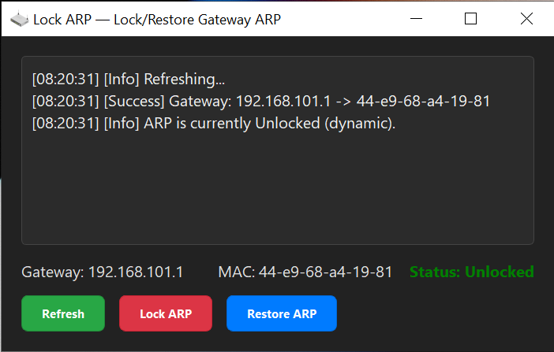

# 🛡️ Lock ARP Tool 🛡️

## Khóa và Khôi phục ARP cho Gateway mặc định trên Windows

**Lock ARP Tool** là một ứng dụng GUI (giao diện đồ họa) nhỏ gọn và mạnh mẽ được phát triển bằng PyQt5, cho phép bạn dễ dàng quản lý mục ARP tĩnh (static ARP entry) cho Default Gateway của mình trên hệ điều hành Windows.

Mục đích chính của công cụ này là tăng cường bảo mật mạng cục bộ bằng cách ngăn chặn các cuộc tấn công ARP Spoofing/Poisoning (giả mạo ARP) nhằm vào máy tính của bạn, đảm bảo rằng dữ liệu của bạn luôn được gửi đến Default Gateway (router) thực chứ không phải qua một kẻ tấn công.


*(Lưu ý: Bạn cần tạo một file `screenshot.png` trong cùng thư mục với README này để hình ảnh hiển thị.)*

---

## 🚀 Tính năng nổi bật

*   **Phát hiện tự động Gateway & MAC:** Tự động tìm kiếm địa chỉ IP của Default Gateway và địa chỉ MAC tương ứng.
*   **Khóa ARP (Lock ARP):** Đặt một mục ARP tĩnh (static ARP entry) cho Default Gateway của bạn. Điều này hướng dẫn hệ điều hành của bạn luôn sử dụng địa chỉ MAC cụ thể đó cho Gateway, bỏ qua các phản hồi ARP động (dynamic ARP responses) tiềm ẩn nguy hiểm.
*   **Khôi phục ARP (Restore ARP):** Xóa mục ARP tĩnh đã đặt, cho phép hệ thống trở lại sử dụng các phản hồi ARP động như bình thường.
*   **Giao diện người dùng thân thiện:** Giao diện đồ họa trực quan, dễ sử dụng.
*   **Chủ đề tối (Dark Theme):** Thiết kế hiện đại với tông màu tối dễ nhìn, giảm mỏi mắt.
*   **Log trực tiếp:** Hiển thị các thao tác và kết quả theo thời gian thực trong cửa sổ ứng dụng.
*   **Thông báo rõ ràng:** Sử dụng các hộp thoại thông báo để cung cấp phản hồi rõ ràng về các thao tác thành công, thất bại hoặc yêu cầu quyền.
*   **Yêu cầu quyền Administrator:** Tự động yêu cầu quyền Administrator khi cần thiết để thực hiện các thao tác thay đổi cấu hình mạng.
*   **Đóng gói thành EXE:** Có thể đóng gói thành một tệp `.exe` duy nhất để dễ dàng di chuyển và sử dụng mà không cần cài đặt Python.

---

## 💡 Tại sao cần khóa ARP?

**ARP (Address Resolution Protocol)** là một giao thức cơ bản trong mạng cục bộ (LAN) giúp dịch địa chỉ IP thành địa chỉ MAC vật lý. Khi máy tính của bạn muốn gửi dữ liệu đến một địa chỉ IP trên mạng nội bộ (ví dụ: Default Gateway), nó sẽ gửi một yêu cầu ARP để hỏi "MAC của IP này là gì?".

**Tấn công ARP Spoofing/Poisoning** xảy ra khi một kẻ tấn công gửi các gói phản hồi ARP giả mạo, tuyên bố rằng địa chỉ MAC của chúng là MAC của Default Gateway (hoặc một máy tính khác). Nếu máy tính của bạn bị lừa, nó sẽ gửi toàn bộ lưu lượng truy cập qua kẻ tấn công thay vì đến đích thực. Kẻ tấn công sau đó có thể nghe lén, sửa đổi hoặc chặn dữ liệu của bạn.

Bằng cách khóa ARP (đặt static ARP entry) cho Default Gateway, bạn đang cứng hóa mục ARP đó trong bảng ARP của máy tính mình. Điều này có nghĩa là máy tính của bạn sẽ **chỉ tin tưởng và sử dụng** địa chỉ MAC mà bạn đã khóa, bất kể có gói ARP giả mạo nào cố gắng thay đổi nó. Đây là một biện pháp phòng thủ hiệu quả để bảo vệ máy tính của bạn khỏi các cuộc tấn công ARP Spoofing.

---

## ⚙️ Yêu cầu hệ thống

*   Hệ điều hành: **Windows** (7, 8, 10, 11)
*   Quyền Administrator để thực hiện các thao tác Lock/Restore ARP.

---

## ⬇️ Cài đặt và Chạy

### Cách 1: Chạy từ mã nguồn (Dành cho nhà phát triển/người dùng nâng cao)

1.  **Cài đặt Python:** Đảm bảo bạn đã cài đặt [Python 3](https://www.python.org/downloads/) trên hệ thống của mình.
2.  **Cài đặt PyQt5:** Mở Command Prompt (CMD) hoặc PowerShell và chạy lệnh sau:
    ```bash
    pip install PyQt5
    ```
3.  **Tải xuống mã nguồn:** Tải tệp `lock_arp_gui.py` và `icon.png` về máy tính của bạn, đặt chúng trong cùng một thư mục.
4.  **Chạy ứng dụng:** Mở CMD hoặc PowerShell, điều hướng đến thư mục chứa các tệp và chạy lệnh:
    ```bash
    python lock_arp_gui.py
    ```

### Cách 2: Chạy từ tệp EXE đã đóng gói (Dễ dàng nhất)

1.  **Tải xuống tệp EXE:** Tải xuống phiên bản `.exe` đã đóng gói (nếu có sẵn) từ trang phát hành của dự án này.
2.  **Chạy ứng dụng:** Nhấp đúp vào tệp `.exe`. Khi ứng dụng yêu cầu quyền Administrator (thông qua User Account Control - UAC), hãy đồng ý để nó có thể thực hiện các thao tác ARP.

---

## 🛠️ Hướng dẫn sử dụng

1.  **Khởi động ứng dụng:** Khi bạn mở ứng dụng, nó sẽ tự động cố gắng phát hiện Default Gateway và địa chỉ MAC của nó. Kết quả sẽ hiển thị trên giao diện và trong khu vực log.
2.  **Làm mới (Refresh):** Nhấn nút `Refresh` để quét lại thông tin Gateway và MAC. Điều này hữu ích nếu Gateway của bạn thay đổi hoặc nếu bạn muốn cập nhật trạng thái ARP.
3.  **Khóa ARP (Lock ARP):**
    *   Đảm bảo Gateway và MAC đã được phát hiện thành công.
    *   Nhấn nút `Lock ARP`.
    *   Nếu ứng dụng chưa chạy với quyền Administrator, nó sẽ nhắc bạn khởi chạy lại với quyền này. Đồng ý để tiếp tục.
    *   Ứng dụng sẽ xóa mục ARP cũ (nếu có) và thiết lập mục ARP tĩnh mới cho Gateway của bạn.
    *   Trạng thái sẽ chuyển sang `Locked` (màu đỏ). Nút `Lock ARP` sẽ bị vô hiệu hóa, và `Restore ARP` sẽ được kích hoạt.
4.  **Khôi phục ARP (Restore ARP):**
    *   Nhấn nút `Restore ARP`.
    *   Nếu ứng dụng chưa chạy với quyền Administrator, nó sẽ nhắc bạn khởi chạy lại với quyền này. Đồng ý để tiếp tục.
    *   Ứng dụng sẽ xóa mục ARP tĩnh cho Gateway.
    *   Nếu việc xóa mục cụ thể thất bại (ví dụ: mục đó không tồn tại hoặc đã bị thay đổi), ứng dụng có thể hỏi bạn có muốn thử xóa TẤT CẢ các mục ARP để đảm bảo không còn mục tĩnh nào. Hãy cẩn trọng khi chọn tùy chọn này vì nó có thể tạm thời làm mất kết nối mạng cục bộ của bạn với các thiết bị khác.
    *   Trạng thái sẽ chuyển sang `Unlocked` (màu xanh lá). Nút `Restore ARP` sẽ bị vô hiệu hóa, và `Lock ARP` sẽ được kích hoạt.

---

## 📦 Đóng gói ứng dụng thành tệp EXE (Sử dụng PyInstaller)

Để tạo một tệp `.exe` duy nhất mà không yêu cầu cài đặt Python trên máy tính mục tiêu, bạn có thể sử dụng `PyInstaller`.

1.  **Cài đặt PyInstaller:**
    ```bash
    pip install pyinstaller
    ```
2.  **Chuẩn bị tệp:** Đảm bảo tệp `lock_arp_gui.py` và `icon.png` nằm trong cùng một thư mục.
3.  **Chạy lệnh đóng gói:** Mở Command Prompt (CMD) hoặc PowerShell, điều hướng đến thư mục chứa các tệp và chạy lệnh sau:
    ```bash
    pyinstaller --onefile --noconsole --uac-admin --icon=icon.png --add-data "icon.png;." lock_arp_gui.py
    ```
    *   `--onefile`: Đóng gói tất cả vào một tệp EXE duy nhất.
    *   `--noconsole`: Không hiển thị cửa sổ console đen khi chạy ứng dụng.
    *   `--uac-admin`: Yêu cầu quyền Administrator khi chạy EXE trên Windows (sẽ hiển thị User Account Control - UAC prompt). Rất quan trọng vì ứng dụng này cần quyền admin để thao tác ARP.
    *   `--icon=icon.png`: Đặt biểu tượng cho tệp EXE và cửa sổ ứng dụng từ `icon.png`.
    *   `--add-data "icon.png;."`: Đảm bảo tệp `icon.png` được đóng gói bên trong EXE và có thể truy cập được bởi ứng dụng trong thời gian chạy.

4.  **Kiểm tra tệp EXE:** Sau khi quá trình hoàn tất, bạn sẽ tìm thấy tệp `.exe` trong thư mục `dist` (ví dụ: `dist/lock_arp_gui.exe`). Bạn có thể sao chép tệp này sang máy tính Windows khác và chạy mà không cần cài đặt gì thêm.

---

## 🤝 Đóng góp

Mọi đóng góp, báo cáo lỗi hoặc đề xuất cải tiến đều được hoan nghênh! Vui lòng mở một Issue hoặc tạo Pull Request trên kho lưu trữ (nếu có) của dự án này.

---

## 📄 Giấy phép (License)

Ứng dụng này được phát hành dưới giấy phép MIT. Xem tệp `LICENSE` (nếu có) để biết thêm chi tiết.

---

## 📞 Liên hệ

*   **Tên của bạn/Tổ chức:** [Điền tên của bạn hoặc tên tổ chức của bạn vào đây]
*   **Email (tùy chọn):** [Điền email của bạn vào đây]
*   **Website/GitHub (tùy chọn):** [Điền link GitHub hoặc website của bạn vào đây]